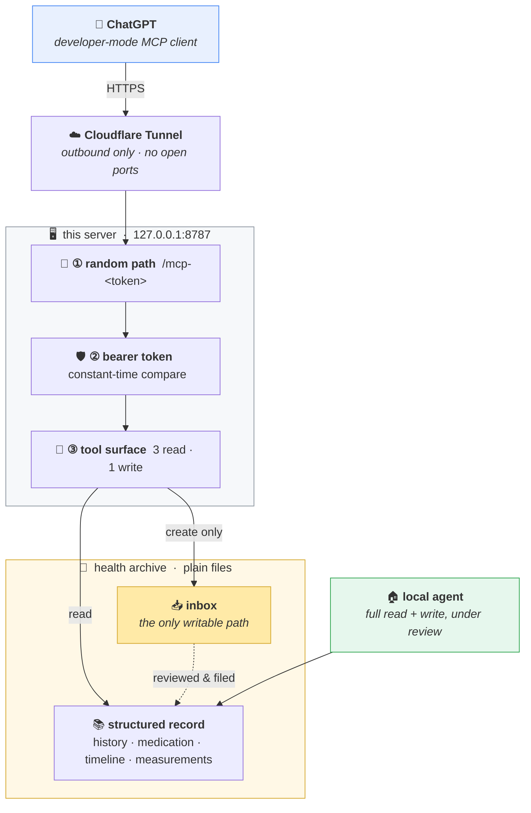

<div align="center">

# 🩺 family-health-mcp

### The model can read everything it is allowed to see — and write exactly one thing.

An MCP server that connects a hosted LLM client to a **local, file-based health archive**,
without ever handing the model write access to the archive itself.

<br/>

[](https://www.python.org/)
[](https://modelcontextprotocol.io/)
[](https://github.com/jlowin/fastmcp)
[](LICENSE)
[](#)

</div>

<br/>

|  | |
|---|---|
| 🔒 | **Least privilege by construction** — three read-only tools, one write tool, no delete or rename anywhere |
| 📐 | **Output contract enforced in code** — a malformed report fails the tool call, it is not merely discouraged in a prompt |
| 👥 | **Multi-tenant** — one bearer token per person, scoped on *resolved* paths so `../` cannot walk out |
| 🕳️ | **No inbound ports** — an outbound tunnel fronts a loopback-only server |
| 📄 | **Plain files** — the archive is Markdown, JSON and CSV, and outlives whatever app reads it |

> [!NOTE]
> The code comments and tool descriptions are in Chinese on purpose: they are not documentation,
> they are the prompt the model reads at runtime, and the archive they describe is Chinese.
> This README is the English documentation.

---

## 💡 Why

A health archive is worth keeping in plain files — reports, medication lists, symptom notes, lab
values — because plain files outlive every app you would otherwise store them in. But a plain-file
archive is only useful if something can read it back to you when you need it, including when you
are away from the machine that holds it.

A hosted assistant is good at that conversation. It is a poor choice for *owning* the archive: it
has no memory across sessions, it will happily reorganise files you never asked it to touch, and
general write access to medical records means one bad turn can quietly corrupt the record.

Hence the split this project implements:

<div align="center">

### **the hosted model collects · the local side archives**

</div>

The remote end reads anything it is allowed to see, and deposits exactly one kind of thing — a
structured report — into an inbox. Everything that changes the *shape* of the archive happens
locally, on demand, under review.

---

## 🏗️ Architecture



---

## 📁 The archive

The whole system rests on one design choice: **the archive is a directory, not a database.**
Every layer above it — this server, the local agent, whatever replaces them in five years — is
replaceable, because none of them owns the data.

```
health-archive/
│
├── docs/                        shared rules and operating procedures
│   └── rules.md                 the single authority on how records are written
│
└── members/<name>/
    │
    ├── allergies-medication.md  safety-critical — read before any advice
    ├── history.md               entries tagged active / resolved / ruled-out
    ├── follow-ups.md            due dates and questions for the next visit
    ├── index.md                 timeline — the index into everything below
    │
    ├── originals/YYYY/          scans, PDFs, photos — never edited, never deleted
    ├── notes/YYYY/              narrative notes derived from those originals
    ├── measurements/*.csv       self-measurement series (blood pressure, weight, …)
    │
    └── inbox/                   📥 the only path this server can write to
        └── filed/YYYY/          reports that have been reviewed and archived
```

<sub>Filenames are shown here in English. The reference deployment runs a Chinese archive, so the
literal names in `server.py` are the Chinese equivalents.</sub>

Three rules keep it durable:

| | |
|:--|:--|
| **1. Originals are the root** | Scans and reports in `originals/` are never modified or deleted. Everything else can be rebuilt from them. |
| **2. Structure is derived** | The JSON and Markdown are a projection of the originals, not the source of truth — so a bad write is recoverable, not fatal. |
| **3. The intelligent layer is swappable** | All behaviour lives in plain-Markdown procedures under `docs/`. Nothing about the archive assumes *which* model or client is reading it. |

Naming is by **report date**, not filing date (`YYYY-MM-DD_topic`), so the timeline stays true
even when a document is filed months late.

---

## 🧰 The tool surface

The tool surface **is** the security boundary, so it is kept deliberately small.

| Tool | Access | What it can do |
|:--|:--:|:--|
| `list_dir` | 🟢 read | List a directory inside the archive |
| `read_file` | 🟢 read | Read one text file; binaries return metadata only |
| `search` | 🟢 read | Full-text search across `.md` `.json` `.csv` `.txt` |
| `save_report` | 🟡 write | Create **one new file** in the caller's own inbox |

No delete. No rename. No move. No tool that writes to the structured record — history, medication
lists, timelines and measurement series are all unreachable from the remote end. `save_report`
never overwrites: a same-day, same-topic report gets a numeric suffix.

> [!TIP]
> The remote model once proposed five additional tools for itself. All five were declined — each
> one moved a decision from the reviewed local side to the unreviewed remote side.

---

## 📐 Design decisions

### 1 · The output contract is enforced by the server, not requested in the prompt

`save_report` rejects any report missing one of six required sections. Not "please include these
sections" in an instruction the model may drift away from — a validation that **fails the call**:

```python
missing = [s for s in REPORT_SECTIONS if s not in content]
if missing:
    raise ValueError(...)          # -> "report is missing required sections: ..."
```

<div align="center">

`topic summary` · `the user's own words, verbatim` · `full transcription of files`
`advice given` · `self-measured values` · `handover items`

</div>

The second one carries the most weight: the model must preserve **what the user actually said**,
not its own paraphrase — because the paraphrase is where detail silently disappears.

### 2 · Scoping is checked on resolved paths

Each bearer token maps to `{member, scope}`. A `self` token reaches only its own member directory
plus shared documents; `all` is unrestricted. The check runs on the *resolved* path, so `../`
cannot escape:

```python
p = (ARCHIVE / rel).resolve()
if not p.is_relative_to(ARCHIVE):
    raise ValueError(...)          # -> "path escapes the archive"
```

Adding a family member: create the directory, add a token line, restart. Revoking: delete the
line, restart.

### 3 · Predictable model mistakes are fixed in code, not in the prompt

The remote model has no memory across sessions, so every new conversation repeats the same
mistakes. Asking it more nicely cannot work — it never saw the previous conversation. **Repeated,
predictable friction belongs in the server.**

Concretely: the model kept writing `alice/history.md` instead of `members/alice/history.md`.
Rather than adding another line to the prompt, read paths now self-correct — if `<path>` does not
exist but `members/<path>` does, the latter is used.

---

## 🔐 Security model

Three independent layers, all of which must pass:

```
①  a long random path      →  the endpoint URL alone is unguessable
②  a bearer token          →  hmac.compare_digest, resolves to an identity
③  a small tool surface    →  read-biased, plus resolved-path scope checks
```

The host exposes **no inbound ports** — the tunnel dials out. Path token and bearer token live in
separate files so either can be rotated alone.

> [!WARNING]
> **Known limitation.** Static bearer tokens are not part of the MCP authorization spec, which
> expects OAuth. This works because the client accepts a static access token. If that changes,
> this is the piece that has to be replaced.

---

## 🚀 Setup

<details>
<summary><b>Install and run</b></summary>

<br/>

```bash
git clone https://github.com/kevinave/family-health-mcp.git
cd family-health-mcp
python3 -m venv .venv && source .venv/bin/activate
pip install -r requirements.txt

cp .env.example .env                     # then set ARCHIVE_PATH
cp tokens.example.json tokens.json       # then generate real tokens
python3 -c "import secrets; print(secrets.token_hex(24))" > .path_token

set -a; source .env; set +a
python3 server.py
```

Generate one token per person:

```bash
python3 -c "import secrets; print(secrets.token_hex(24))"
```

and add it to `tokens.json` as `"<token>": {"member": "alice", "scope": "self"}`.

Each member needs `members/<name>/` to exist before `save_report` will accept anything for them.

</details>

<details>
<summary><b>Connect the client</b></summary>

<br/>

Expose `127.0.0.1:8787` through a tunnel and add the resulting URL as a developer-mode MCP
connector:

| Field | Value |
|:--|:--|
| URL | `https://<your-host>/mcp-<path_token>` |
| Auth | access token / API key |
| Scheme | bearer |
| Token | from `tokens.json` |

`deploy/` has example launchd and cloudflared configuration for running both as always-on services.

</details>

---

## 🔍 Notes from operation

Two failures worth writing down, because in both the obvious diagnosis was wrong.

<details>
<summary><b><code>read_file</code> deadlocked while <code>list_dir</code> and <code>search</code> looked fine</b></summary>

<br/>

`read_file` returned `[Errno 11] Resource deadlock avoided`. The archive lives in a cloud-synced
folder; under disk pressure the OS had evicted files to dataless placeholders, and reading one
synchronously inside the server's single-threaded event loop triggered an in-process
materialisation deadlock.

What made it look like *one broken tool* was `search`'s own error handling — its
`except (UnicodeDecodeError, OSError): continue` swallowed exactly the same error, so only
`read_file` ever surfaced it.

The fix went to the **storage layer** (pin the archive to local storage), not to a
"force-download before reading" patch in the server. The server was not the thing that was wrong.

</details>

<details>
<summary><b>After renaming a tool, unrenamed tools kept working — but the renamed one 404'd</b></summary>

<br/>

The client reported `Unknown tool` for the renamed tool while everything else behaved normally,
which is a genuinely confusing signal. Client-side tool lists are cached and do not refresh on
their own.

Any change to the tool set now ends with: refresh the connector, then start a **new** conversation.

</details>

---

## 📋 Scope

A personal system published as a reference implementation, not a product. It assumes a single
trusted operator, a handful of users, and an archive that fits on one machine.

> [!IMPORTANT]
> **This is not medical software and it gives no medical advice.** The assistant's role in this
> design is to record what was said and surface what is already in the archive.
> Diagnosis is not one of its tools.

---

<div align="center">

MIT © [Shengping Huang](https://kevinave.com)

</div>
