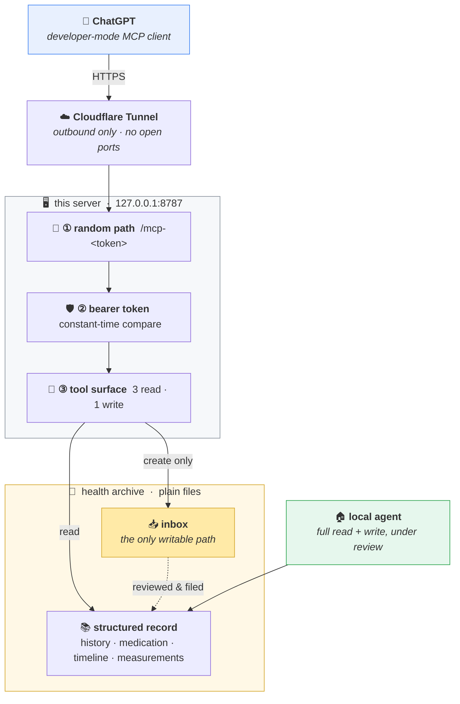

<div align="center">

# 🩺 family-health-mcp

### The model can read everything it is allowed to see — and write exactly one thing.

An MCP server that connects a hosted LLM client to a **local, file-based health archive**,
without ever handing the model write access to the archive itself.

<br/>

[](https://www.python.org/)
[](https://modelcontextprotocol.io/)
[](https://github.com/jlowin/fastmcp)
[](https://github.com/kevinave/family-health-mcp/actions/workflows/ci.yml)
[](LICENSE)


</div>

---

## Why

The archive and a local agent already worked well together. The problem was everywhere else — at a
clinic, on a phone, away from the machine holding the files. I could already reach it by SSH, so
capability was never the issue; the issue was that every conversation had to *start* with
connecting, and that small ritual is enough to make you skip it.

So instead of a better way to reach the archive, put the archive inside the app that is already
open. Which leaves one question worth answering carefully: **how much authority should a hosted
model have over medical records?**

---

## Architecture



**The hosted model collects; the local side archives.** It reads what it is allowed to see and
deposits exactly one kind of thing — a structured report — into an inbox. Everything that changes
the *shape* of the archive happens locally, under review.

---

## The tool surface is the security boundary

| Tool | Access | What it can do |
|:--|:--:|:--|
| `list_dir` | 🟢 read | List a directory inside the archive |
| `read_file` | 🟢 read | Read one text file; binaries return metadata only |
| `search` | 🟢 read | Full-text search across the archive |
| `save_report` | 🟡 write | Create **one new file** in the caller's own inbox |

No delete, no rename, no move, and nothing that writes to the structured record — history,
medication lists and measurement series are unreachable from the remote end.

And the report contract is **enforced in code, not requested in the prompt**. A report missing any
of its six required sections fails the tool call:

```python
missing = [s for s in REPORT_SECTIONS if s not in content]
if missing:
    raise ValueError(...)          # -> "report is missing required sections: ..."
```

The section that carries the most weight asks for the user's own words, verbatim — because the
paraphrase is where detail silently disappears.

Every rule in this section is pinned by [`tests/`](tests/): the suite starts the real HTTP server
over a throwaway archive and attacks it through the same three gates a client passes — wrong path,
wrong token, `../` traversal, another member's files, a report with a section missing.

> [!TIP]
> The remote model once proposed five additional tools for itself. All five were declined: each one
> moved a decision from the reviewed local side to the unreviewed remote side.

---

<details>
<summary><b>Security model</b></summary>

<br/>

Three independent layers, all of which must pass:

1. **A long random path** — the endpoint is mounted at `/mcp-<path_token>`, and the URL alone is unguessable.
2. **A bearer token** — compared with `hmac.compare_digest`, resolving to an identity attached to the request.
3. **A small, read-biased tool surface** — plus scope checks on *resolved* paths, so `../` cannot escape:

```python
p = (ARCHIVE / rel).resolve()
if not p.is_relative_to(ARCHIVE):
    raise ValueError(...)          # -> "path escapes the archive"
```

Each bearer token maps to `{member, scope}`: a `self` token reaches only its own member directory,
`all` is unrestricted. Adding someone is one line and a restart; revoking is deleting that line.

The host exposes no inbound ports — the tunnel dials out. Path token and bearer token live in
separate files so either can be rotated alone.

⚠️ **Known limitation.** Static bearer tokens are not part of the MCP authorization spec, which
expects OAuth. This works because the client accepts a static access token; if that changes, this is
the piece to replace.

</details>

<details>
<summary><b>The archive</b></summary>

<br/>

The whole system rests on one choice: **the archive is a directory, not a database.** Every layer
above it is replaceable, because none of them owns the data.

```
health-archive/
├── docs/                        shared rules and operating procedures
└── members/<name>/
    ├── allergies-medication.md  safety-critical — read before any advice
    ├── history.md               entries tagged active / resolved / ruled-out
    ├── follow-ups.md            due dates and questions for the next visit
    ├── index.md                 timeline — the index into everything below
    ├── originals/YYYY/          scans, PDFs, photos — never edited, never deleted
    ├── notes/YYYY/              narrative notes derived from those originals
    ├── measurements/*.csv       self-measurement series
    └── inbox/                   📥 the only path this server can write to
```

Originals are never modified, so everything else can be rebuilt from them; the structured files are
a projection, not the source of truth, which makes a bad write recoverable rather than fatal. Files
are named by report date, not filing date, so the timeline stays true when a document arrives late.

<sub>Names are shown in English here; the reference deployment runs a Chinese archive, so the
literal names in `server.py` are the Chinese equivalents.</sub>

</details>

<details>
<summary><b>What is in the repository</b></summary>

<br/>

| Piece | Role |
|:--|:--|
| `server.py` | the whole server — four tools, scope checks, bearer middleware |
| `tests/` | the security model, pinned end-to-end: the three gates, scope isolation, the report contract |
| `prompts/` | the role prompt pasted into the client — the server decides what the model **can** do, this file says what it **should** do |
| `deploy/` | example launchd and Cloudflare Tunnel configuration for the always-on setup |
| `.env.example` · `tokens.example.json` | configuration templates — nothing secret is committed |

The prompt file is part of the system on purpose: authority lives in code, behaviour lives in the
prompt, and keeping the prompt in the repo is what keeps the two in sync when a tool contract
changes.

</details>

<details>
<summary><b>Setup</b></summary>

<br/>

```bash
git clone https://github.com/kevinave/family-health-mcp.git
cd family-health-mcp
python3 -m venv .venv && source .venv/bin/activate
pip install -r requirements.txt

cp .env.example .env                     # then set ARCHIVE_PATH
cp tokens.example.json tokens.json       # then generate real tokens
python3 -c "import secrets; print(secrets.token_hex(24))" > .path_token

set -a; source .env; set +a
python3 server.py
```

To run the test suite (no archive or tokens needed — it builds its own):

```bash
pip install -r requirements-dev.txt
pytest
```

Generate one token per person with `secrets.token_hex(24)` and add it to `tokens.json` as
`"<token>": {"member": "alice", "scope": "self"}`. Each member needs `members/<name>/` to exist
before `save_report` will accept anything for them.

Expose `127.0.0.1:8787` through a tunnel and add the URL as a developer-mode MCP connector:
`https://<your-host>/mcp-<path_token>`, auth = access token, scheme = bearer.
`deploy/` has example launchd and cloudflared configuration.

Finally, paste [`prompts/chatgpt-project-instructions.md`](prompts/chatgpt-project-instructions.md)
into the client's project instructions — that is the behavioural half of the system.

</details>

<details>
<summary><b>Notes from operation</b></summary>

<br/>

**`read_file` deadlocked while `list_dir` and `search` looked fine.** The archive lives in a
cloud-synced folder; under disk pressure the OS had evicted files to dataless placeholders, and
reading one synchronously inside a single-threaded event loop deadlocked. What made it look like
*one* broken tool was `search`'s own `except OSError: continue`, which swallowed the identical
error. The fix belonged in the storage layer, not in the server.

**After renaming a tool, the unrenamed ones kept working.** Client-side tool lists are cached.
Any change to the tool set now ends with: refresh the connector, then start a new conversation.

</details>

---

## Scope

A personal system published as a reference implementation, not a product. It assumes one trusted
operator and an archive that fits on a single machine.

> [!IMPORTANT]
> **Not medical software, and it gives no medical advice.** The assistant's role here is to record
> what was said and surface what is already in the archive. Diagnosis is not one of its tools.

<div align="center">
<br/>

MIT © [kevinave](https://github.com/kevinave)

</div>
